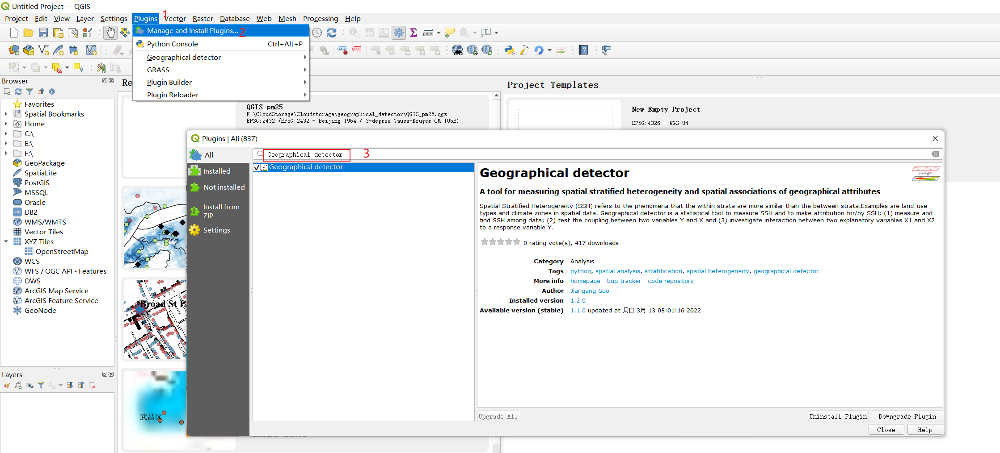

# QGIS-Geographical-detector

QGIS geographical detector plugin: Tool for measuring spatial stratified heterogeneity and spatial associations of geographical attributes.

## Geographical detector
Geographical detector, or GeoDetector, is a statistical tool to measure Spatial Stratified Heterogeneity (SSH) and to make attribution for/by SSH; 
(1) measure and find SSH among data;
(2) test the coupling between two variables Y and X and 
(3) investigate interaction between two explanatory variables X1 and X2 to a response variable Y.
## Installation

## Parameters

## References
1. Wang JF, Li XH, Christakos G, Liao YL, Zhang T, Gu X & Zheng XY. 2010. Geographical detectors-based health risk assessment and its application in the neural tube defects study of the Heshun region, China. International Journal of Geographical Information Science 24(1): 107-127.
2. Wang JF, Zhang TL, Fu BJ. 2016. A measure of spatial stratified heterogeneity. Ecological Indicators 67: 250-256.
3. GeoDetector Website (http://www.geodetector.cn/)

